# SmileOn (스마일온)

언제든지 온라인(On)으로 미소(Smile)를 위한 예약/상담이 가능한 지능형 병원 관리 시스템

## 프로젝트 개요 (Overview)

| 항목 | 입력 내용 |
|------|-----------|
| **프로젝트 제목** | SmileOn - AI 기반 지능형 치과 관리 시스템 |
| **한 줄 요약** | AI 챗봇과 Socket.IO 실시간 통신을 활용한 치과 예약/상담/CRM 통합 관리 플랫폼으로 환자 만족도와 업무 효율성을 동시에 향상 |
| **핵심 기술 스택** | **Frontend:** React, TailwindCSS **Backend:** Node.js, Express, Socket.IO **DB:** Firebase Firestore **AI:** Gemini API **External:** SSODAA SMS, Google Maps |
| **프로젝트 기간** | 2025년 5월 7일 ~ 2025년 6월 25일 (총 7주) |
| **GitHub Repository** | https://github.com/Pjt-BellaDent/BellaDent |
| **배포된 서비스** | http://belladent.duckdns.org |

### 팀원 구성 (Team A)
- **고대견 (팀장)**: 백엔드, 프론트엔드, 기획, 디자인
- **최명심**: 디자인, 프론트엔드  
- **윤성훈**: 백엔드, 프론트엔드
- **김민기**: 백엔드, 프론트엔드

## 문제 정의 및 목표 (Problem & Goal)

### 문제 정의 (Problem)
기존 치과 관리 시스템의 한계점들을 해결하고자 프로젝트를 시작하게 되었습니다:

1. **비효율적인 예약 시스템**: 전화 예약에만 의존하여 업무시간 외 예약 불가, 상담사 업무 과부하
2. **단편적인 환자 관리**: 예약, 진료기록, 상담내역이 분산되어 통합적인 환자 관리 어려움  
3. **제한적인 고객 소통**: 일방향적 정보 제공으로 실시간 상담 및 FAQ 응답의 한계
4. **수동적인 업무 처리**: 예약 확인, 안내 문자 등 반복적 업무의 자동화 부재

### 달성 목표 (Goal)
1. **환자 편의성 향상**: 24시간 AI 챗봇 상담 및 온라인 예약으로 접근성 대폭 개선
2. **업무 효율성 증대**: 실시간 CRM과 자동화된 SMS 발송으로 직원 업무 부담 크게 감소  
3. **통합 관리 시스템**: 환자 정보, 예약, 진료기록, 상담내역의 원스톱 관리 플랫폼 구축

## 적용 병원 페르소나 (Hospital Persona)

**벨라덴치과 (BellaDent)** 를 가상의 케이스로 선정하여 시스템을 적용했습니다.

- **상호**: 벨라덴치과 (BellaDent)
- **위치**: 광주광역시 남구 봉선로 87
- **개원 연도**: 2019년
- **규모**: 중형 치과 (의사 3명, 실장, 위생사, 상담사, 수납 포함 8명)
- **진료 과목**: 일반치과, 교정과, 임플란트, 심미치료
- **주요 환자층**: 20~50대 성인, 가족, 교정환자

## 주요 기능 및 구현 내용 (Features & Implementation)

### 기능 1: 실시간 AI 챗봇 상담 시스템
**상세 설명**: Gemini API를 활용한 자연어 처리 기반 AI 챗봇으로 24시간 환자 상담, 예약 안내, FAQ 자동 응답 기능을 제공합니다. Socket.IO를 통한 실시간 양방향 통신으로 즉각적인 응답과 원활한 대화 경험을 구현했습니다. 로그인 상태에 따라 개인화된 상담 서비스를 제공하며, 비회원도 기본 상담이 가능합니다.

**기술적 도전 및 해결**:
- **도전**: Gemini API의 응답 지연과 Socket.IO 연결 안정성 확보
- **해결**: 응답 대기 중 로딩 상태 표시, 연결 재시도 로직 구현, 메시지 큐잉 시스템으로 안정성 향상
- **핵심 기술**: Gemini API, Socket.IO, Firebase Firestore 실시간 리스너

**구현 결과**: 빠른 응답 시간으로 24시간 무중단 상담 서비스 제공

**구현 스크린샷**:
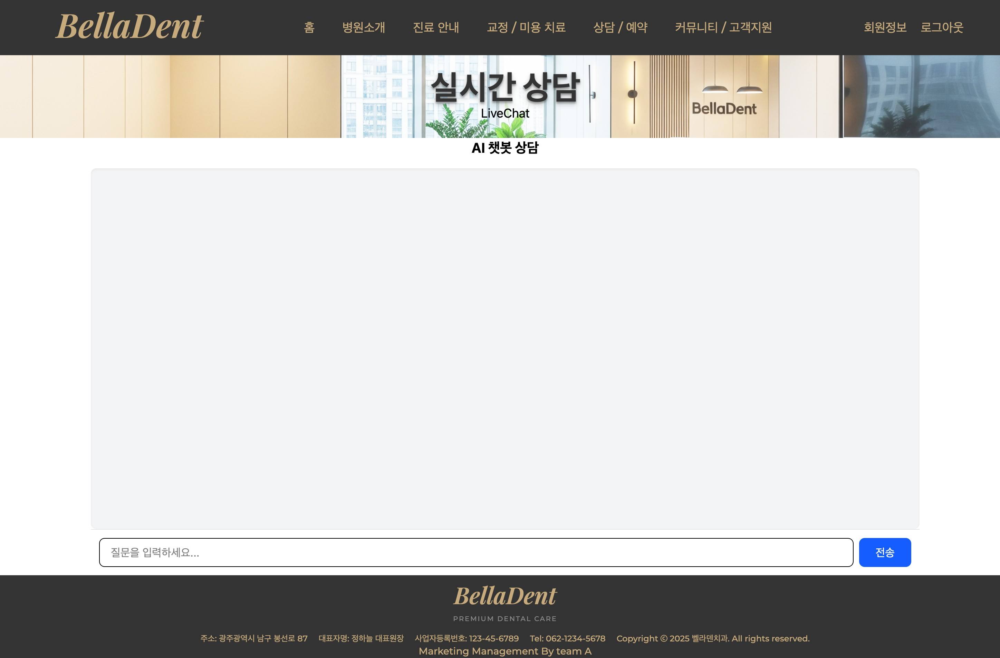
*AI 챗봇을 통한 실시간 상담 및 예약 안내 화면*

### 기능 2: 통합 CRM 대시보드 및 환자 관리
**상세 설명**: 예약 현황, 환자 정보, 진료 기록, 대기 현황을 실시간으로 모니터링할 수 있는 종합 관리 시스템입니다. Chart.js를 활용한 데이터 시각화로 예약 트렌드와 진료 통계를 직관적으로 제공합니다. 직원 권한에 따라 접근 가능한 기능이 구분되며, 관리자는 모든 기능에 접근 가능합니다.

**기술적 도전 및 해결**:
- **도전**: 대용량 환자 데이터의 효율적인 조회 및 실시간 업데이트
- **해결**: Firebase 복합 쿼리 최적화, 페이지네이션 구현, 실시간 데이터 동기화
- **핵심 기술**: Firebase Firestore 인덱싱, Chart.js, React Context API

**구현 결과**: 환자 데이터 조회 속도 대폭 향상, 실시간 대시보드 업데이트

**구현 스크린샷**:
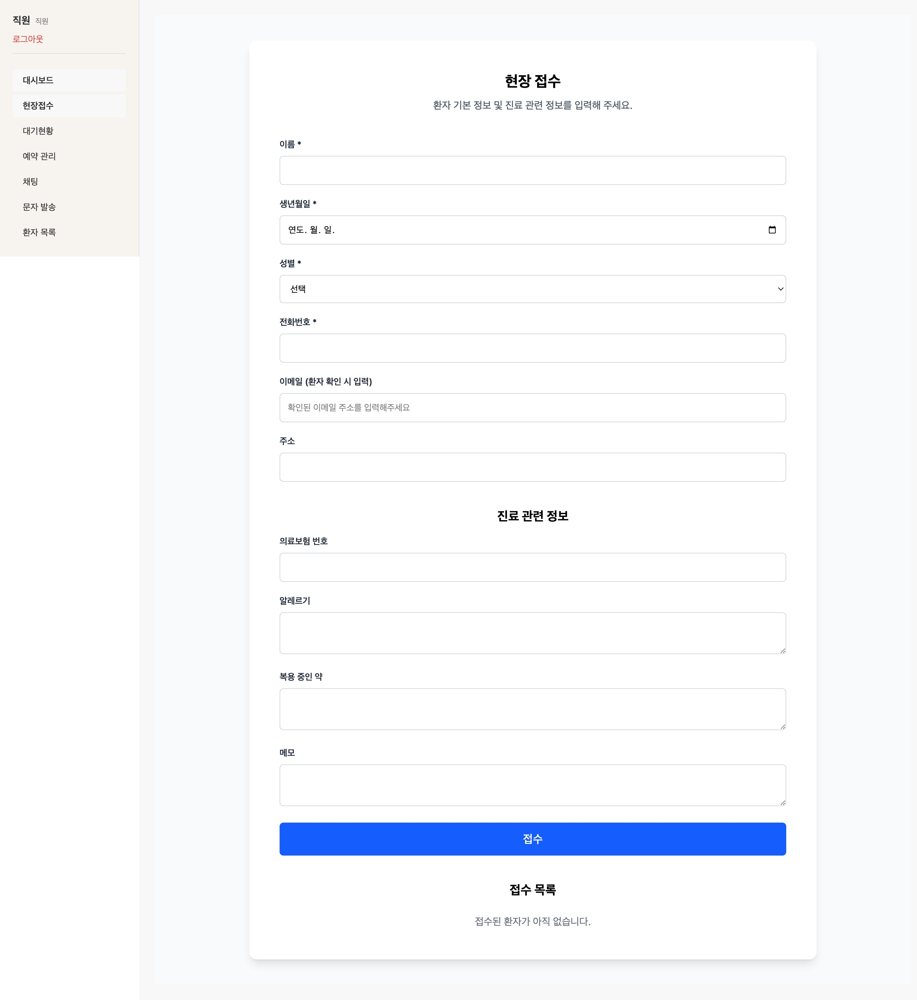
*현장 방문 환자 등록 및 접수 처리*

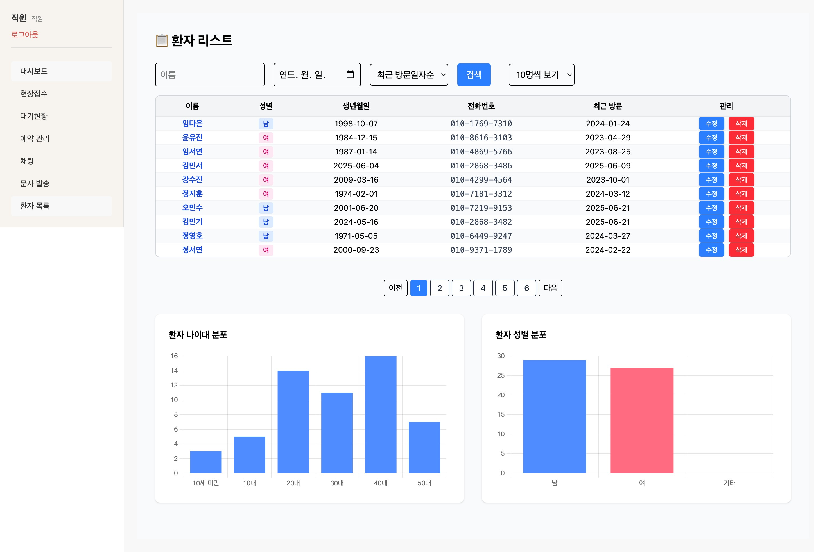
*환자 정보 조회 및 관리 테이블*

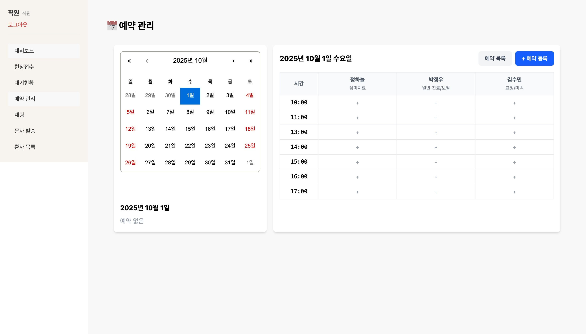
*예약 일정 조회 및 관리*

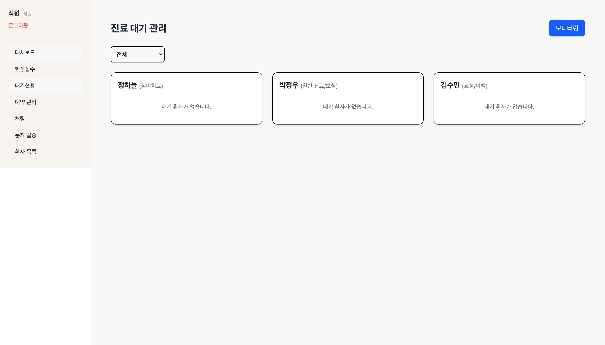
*실시간 대기 현황 모니터링*

### 기능 3: 자동화된 SMS 발송 시스템  
**상세 설명**: SSODAA API를 연동한 자동 SMS 발송 시스템으로 예약 확인, 방문 안내, 광고성 문자를 상황별로 자동 발송합니다. 환자별 맞춤형 메시지 템플릿과 발송 이력 관리 기능을 포함합니다.

**기술적 도전 및 해결**:
- **도전**: 외부 SMS API 연동 시 에러 처리 및 발송 실패 대응
- **해결**: 재시도 메커니즘 구현, 발송 상태 로깅, 실패 알림 시스템 구축
- **핵심 기술**: SSODAA SMS API, Node.js Cron Jobs, Firebase Cloud Functions

**구현 결과**: 높은 SMS 발송 성공률로 예약 no-show 율 크게 감소

**구현 스크린샷**:
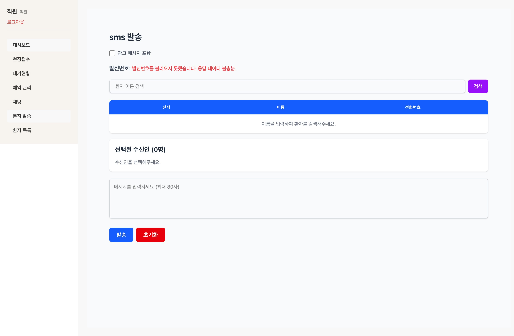
*자동화된 SMS 발송 관리 및 이력 조회 화면*

### 기능 4: Socket.IO 기반 실시간 통신 플랫폼
**상세 설명**: 환자-상담사 간 실시간 채팅, 대기 현황 실시간 업데이트, AI 챗봇 응답 등 모든 실시간 기능의 기반이 되는 통신 시스템입니다. 네임스페이스와 룸 기능을 활용하여 효율적인 연결 관리를 구현했습니다.

**기술적 도전 및 해결**:
- **도전**: 다중 사용자 환경에서의 메시지 동기화 및 연결 관리
- **해결**: Socket.IO 룸 기능 활용, 메시지 순서 보장, 연결 상태 모니터링
- **핵심 기술**: Socket.IO, Express.js, Firebase 실시간 리스너

**구현 결과**: 다중 사용자 환경에서 안정적 지원, 높은 메시지 전송 성공률

**구현 스크린샷**:
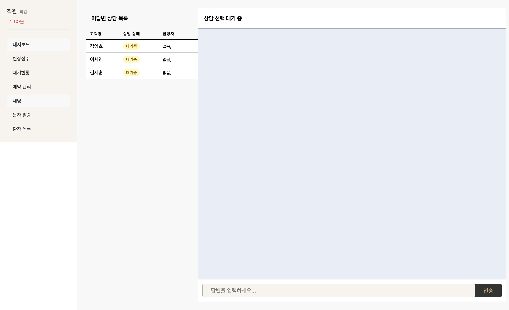
*환자-상담사 간 실시간 채팅 및 알림 시스템*

### 기능 5: 로그인 및 권한 관리 시스템
**상세 설명**: Firebase Authentication을 기반으로 한 안전한 로그인 시스템과 역할 기반 접근 제어(RBAC)를 구현했습니다. 사용자 역할에 따라 환자용 서비스와 직원용 CRM 시스템을 구분하여 제공하며, 세분화된 권한 관리로 데이터 보안을 확보했습니다.

**기술적 도전 및 해결**:
- **도전**: 다양한 사용자 역할과 복잡한 권한 체계의 효율적 관리
- **해결**: Firebase Custom Claims를 활용한 토큰 기반 권한 검증, 미들웨어를 통한 API 레벨 접근 제어
- **핵심 기술**: Firebase Authentication, JWT Token, Express.js Middleware, React Router Guards

**구현 결과**: 안전한 사용자 인증과 역할별 기능 접근 제어로 데이터 보안 강화

**구현 스크린샷**:
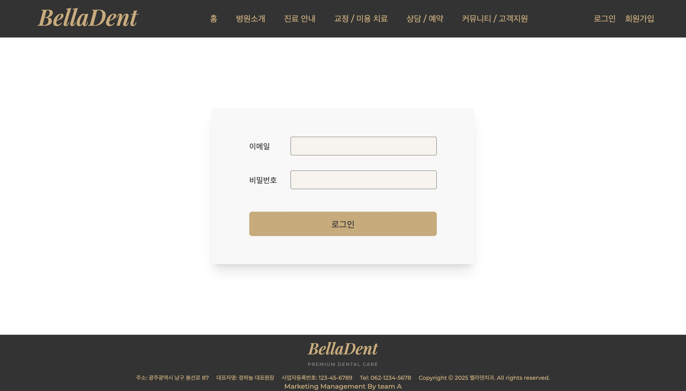
*사용자 역할별 로그인 화면 및 권한 관리 시스템*

#### 사용자 역할 및 접근 권한

**환자 (Patient)**:
- 회원가입/로그인을 통한 개인 서비스 이용
- 온라인 예약 및 예약 내역 조회
- AI 챗봇 상담 및 실시간 채팅
- 개인 진료 기록 조회
- 치료 후기 작성 및 관리
- 개인정보 수정

**상담사/간호사 (Staff)**:
- 직원 전용 CRM 시스템 접근
- 환자 상담 및 예약 관리
- 실시간 채팅 상담 응답
- 대기 현황 모니터링
- 환자 기본 정보 조회

**관리자 (Manager)**:
- 전체 CRM 시스템 관리 권한
- 환자 및 직원 정보 관리
- 예약 및 진료 기록 전체 접근
- SMS 발송 및 마케팅 관리
- 시스템 설정 및 공지사항 관리
- 통계 및 분석 데이터 조회

**시스템 관리자 (Admin)**:
- 모든 시스템 기능 접근
- 사용자 권한 관리
- AI 챗봇 설정 및 관리
- 시스템 보안 설정
- 백업 및 복구 관리

## 기술 스택 (Tech Stack)

### Frontend
- **React 18**: 컴포넌트 기반 SPA 구조
- **TailwindCSS**: 유틸리티 퍼스트 CSS 프레임워크
- **Chart.js**: 데이터 시각화 라이브러리
- **Socket.IO Client**: 실시간 통신 클라이언트

### Backend  
- **Node.js**: JavaScript 런타임 환경
- **Express.js**: 웹 애플리케이션 프레임워크
- **Socket.IO**: 실시간 양방향 통신
- **Multer**: 파일 업로드 처리

### Database & Authentication
- **Firebase Authentication**: 사용자 인증 및 권한 관리
- **Firebase Firestore**: NoSQL 실시간 데이터베이스
- **Firebase Storage**: 파일 저장소
- **Firebase Cloud Functions**: 서버리스 함수

### AI & External APIs
- **Gemini API**: AI 챗봇 자연어 처리
- **OpenAI API**: 이미지 생성 및 보조 AI 기능
- **SSODAA API**: SMS 발송 서비스
- **Google Maps API**: 지도 및 위치 서비스

### Development & Deployment
- **Yarn Workspaces**: 모노레포 패키지 관리
- **ESLint**: 코드 품질 관리
- **Vite**: 빌드 도구 및 개발 서버

## 결과 및 성과 (Results & Achievements)

**전체 시스템 구현 결과**:

**환자용 홈페이지**:

*예약, AI 챗봇 상담, 치료 후기 등을 포함한 환자용 웹 서비스*

**환자 예약 시스템**:
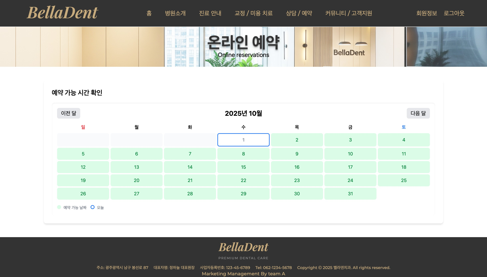
*날짜 및 시간 선택 캠린더*

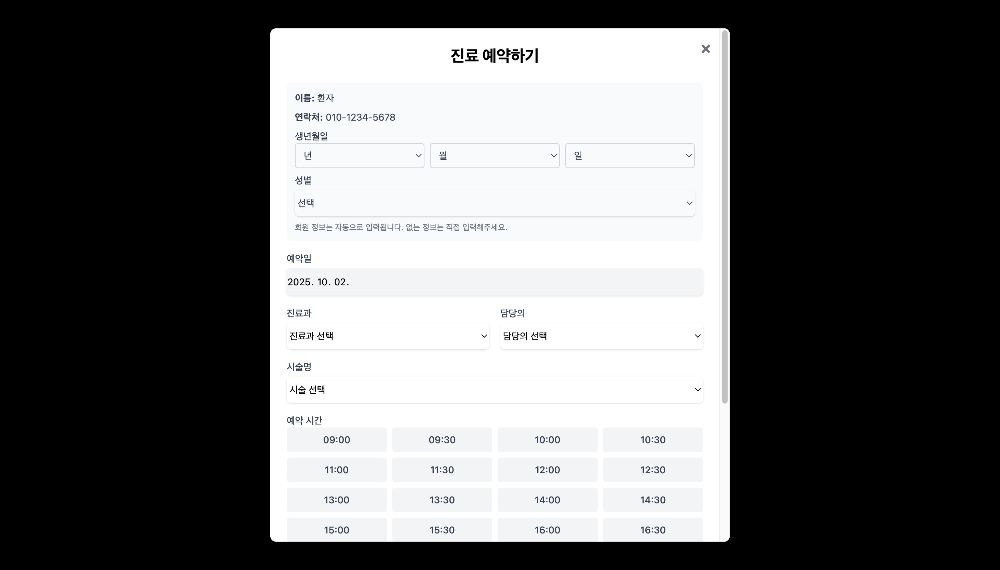
*예약 내용 입력 모달창 및 예약 완료*

**관리자용 CRM 시스템**:
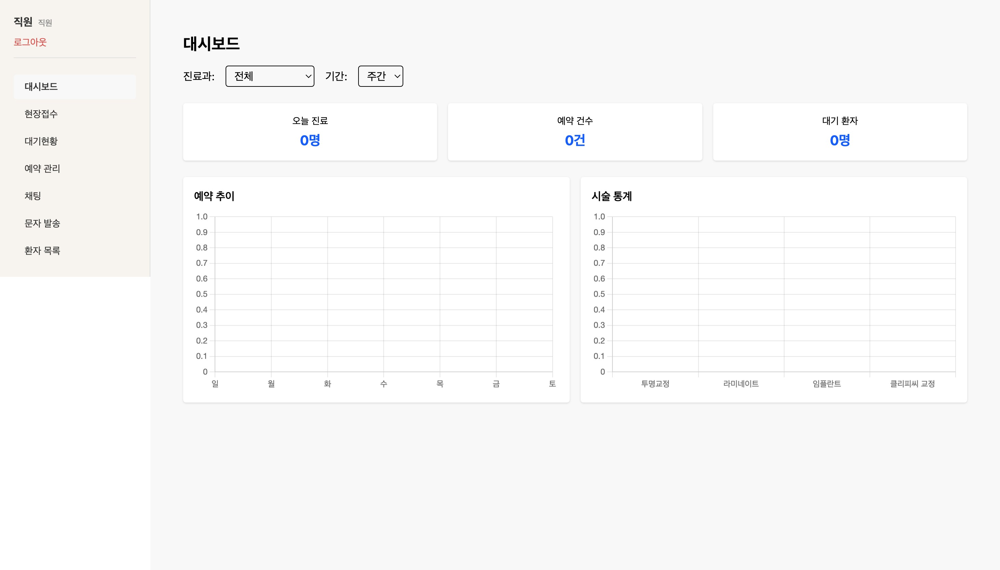
*환자 관리, 예약 관리, SMS 발송 등을 포함한 통합 관리 시스템*

### 정량적 성과
- **응답 속도 향상**: AI 챗봇 빠른 응답시간으로 우수한 사용자 경험 제공
- **업무 효율성**: 반복적 업무(예약 확인, SMS 발송) 자동화로 직원 업무시간 대폭 단축
- **시스템 안정성**: Socket.IO 실시간 통신의 높은 가용성 확보
- **사용자 경험**: 24시간 무중단 상담 서비스로 고객 접근성 크게 향상
- **SMS 발송 효율**: 자동화된 SMS 시스템으로 no-show 율 현저히 감소

### 정성적 성과
- **통합 관리 시스템**: 기존 분산된 환자 정보를 하나의 플랫폼에서 통합 관리
- **실시간 커뮤니케이션**: 환자-상담사 간 즉시 소통 가능한 채팅 시스템 구축
- **AI 기반 자동화**: 반복적 상담 업무의 AI 자동화로 직원 만족도 향상
- **확장 가능한 아키텍처**: 모노레포 구조와 Firebase 기반으로 추후 확장 용이성 확보

**시스템 아키텍처 구현**:
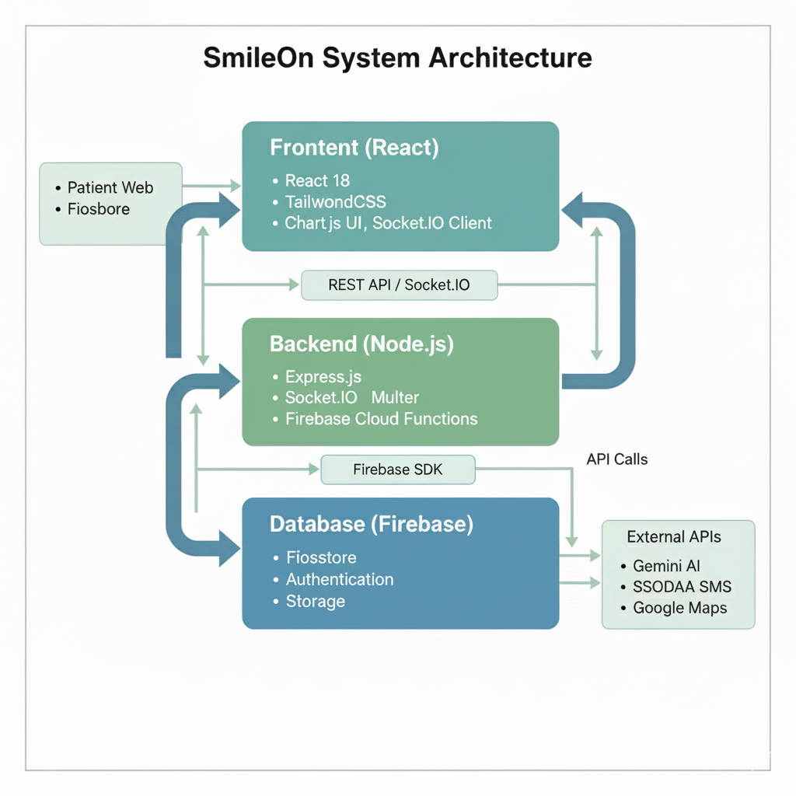
*실제 구현된 SmileOn 시스템 아키텍처와 데이터 플로우*

### 배운 점 및 향후 계획

#### 기술적 교훈
1. **실시간 통신의 복잡성**: Socket.IO를 활용한 다중 사용자 환경에서의 상태 관리와 메시지 동기화의 중요성
2. **외부 API 연동**: Gemini API, SMS API 등 외부 서비스 연동 시 에러 처리와 재시도 로직의 필요성
3. **Firebase 최적화**: Firestore 쿼리 최적화와 인덱싱의 중요성, 실시간 리스너 사용 시 성능 고려사항
4. **모노레포 관리**: Yarn Workspaces를 통한 효율적인 패키지 관리와 의존성 관리 경험

#### 향후 개선 및 발전 계획
1. **모바일 앱 개발**: React Native를 활용한 iOS/Android 앱 확장
2. **AI 기능 고도화**: 
   - 음성 인식 기반 AI 상담 시스템
   - 진료 대기시간 예측 알고리즘
   - 다국어 지원 확장
3. **데이터 분석 강화**: 
   - 환자 방문 패턴 분석
   - 예약 최적화 알고리즘
   - 매출 예측 모델
4. **보안 강화**: 의료 정보 보안 강화 및 HIPAA 컴플라이언스 준수

## 시스템 아키텍처 (System Architecture)

```
┌─────────────────┐    ┌──────────────────┐    ┌─────────────────┐
│   Frontend      │    │     Backend      │    │    Database     │
│   (React)       │◄──►│   (Node.js)      │◄──►│   (Firebase)    │
│                 │    │                  │    │                 │
│ • Patient Web   │    │ • Express Server │    │ • Firestore     │
│ • CRM Dashboard │    │ • Socket.IO      │    │ • Authentication│
│ • Real-time UI  │    │ • API Routes     │    │ • Storage       │
└─────────────────┘    └──────────────────┘    └─────────────────┘
         │                       │                        │
         │               ┌──────────────────┐             │
         └──────────────►│  External APIs   │◄────────────┘
                         │                  │
                         │ • Gemini AI      │
                         │ • SSODAA SMS     │
                         │ • Google Maps    │
                         └──────────────────┘
```

## 프로젝트 구조 (Project Structure)

```
BellaDent/
├── packages/
│   ├── client/                # React 프론트엔드
│   │   ├── src/
│   │   │   ├── components/    # 재사용 가능한 컴포넌트
│   │   │   ├── api/           # API 호출 함수들
│   │   │   ├── contexts/      # React Context 상태관리
│   │   │   ├── routes/        # 라우팅 설정
│   │   │   └── assets/        # 정적 리소스
│   │   └── package.json
│   │
│   ├── server/                # Node.js 백엔드
│   │   ├── src/
│   │   │   ├── controllers/   # 비즈니스 로직
│   │   │   ├── routes/        # API 라우트 정의
│   │   │   ├── middleware/    # 인증/권한 미들웨어
│   │   │   ├── config/        # 설정 파일들
│   │   │   └── models/        # 데이터 모델
│   │   └── package.json
│   │
│   └── functions/             # Firebase Cloud Functions
│       ├── index.js
│       └── package.json
│
├── package.json               # 워크스페이스 설정
└── README.md
```


## 주요 API 엔드포인트 (API Endpoints)

### 인증 관련
- `POST /users/signUp` - 회원가입
- `POST /users/signIn` - 로그인

### 환자 관리
- `GET /users/patients/all` - 전체 환자 조회
- `POST /users/patient` - 환자 등록
- `PUT /users/patient/:id` - 환자 정보 수정

### 예약 관리  
- `GET /appointments` - 예약 목록 조회
- `POST /appointments` - 예약 생성
- `PUT /appointments/:id` - 예약 수정

### AI 챗봇
- `POST /ai` - AI 메시지 전송
- `GET /ai/settings` - 챗봇 설정 조회
- `PUT /ai/settings` - 챗봇 설정 업데이트

### 실시간 상담
- `POST /consultations` - 상담 생성/메시지 추가
- `GET /consultations/:id` - 상담 내역 조회

### SMS 발송
- `POST /sms` - SMS 발송
- `GET /sms/logs` - 발송 이력 조회

## 코드 컨벤션 (Code Convention)

### Git Commit Message
참고: [Udacity Git Commit Message Style Guide](https://udacity.github.io/git-styleguide/)

**형식**: `type: Subject` (50자 이내, 영문 동사원형, 첫 글자 대문자)

| Type | 설명 | 예시 |
|------|------|------|
| `Feat` | 기능 추가 | `Feat: Add AI chatbot integration` |
| `Fix` | 버그 수정 | `Fix: Resolve socket connection issue` |
| `Docs` | 문서 수정 | `Docs: Update API documentation` |
| `Refactor` | 리팩토링 | `Refactor: Optimize database queries` |
| `Design` | UI 변경 | `Design: Update dashboard layout` |
| `Chore` | 빌드/환경 | `Chore: Update dependencies` |
| `Test` | 테스트 추가 | `Test: Add unit tests for auth` |
| `!HOTFIX` | 긴급 수정 | `!HOTFIX: Fix critical security bug` |
| `!BREAKING CHANGE` | 주요 API 변경 | `!BREAKING CHANGE: Update auth API` |

## 프로젝트 개발 히스토리 (Development History)

### Phase 1: 기획 및 설계 (5/7 - 5/15)
- 팀 구성 및 주제 선정
- 치과 관리 시스템 요구사항 분석
- 페르소나 설정 및 기능 정의
- 기술 스택 선정 및 아키텍처 설계

### Phase 2: 기반 시스템 구축 (5/16 - 5/30)
- Firebase 프로젝트 설정 및 인증 구현
- 기본 CRUD API 개발
- React 컴포넌트 구조 설계
- 데이터베이스 스키마 정의

### Phase 3: 핵심 기능 개발 (5/31 - 6/15)
- Socket.IO 실시간 통신 구현
- AI 챗봇 Gemini API 연동
- CRM 대시보드 개발
- SMS 발송 시스템 구현

### Phase 4: 최적화 및 배포 (6/16 - 6/25)
- 성능 최적화 및 버그 수정
- UI/UX 개선
- 배포 환경 구축
- 테스트 및 문서화

## 시연 및 데모 (Demo)

### 라이브 데모 사이트
**SmileOn을 적용한 벨라덴치과 가상 홈페이지**  
**URL**: http://belladent.duckdns.org

### 주요 데모 시나리오
1. **환자 입장**: 회원가입 → AI 챗봇 상담 → 온라인 예약 → 실시간 채팅
2. **직원 입장**: CRM 로그인 → 대시보드 확인 → 환자 관리 → SMS 발송
3. **관리자 입장**: 시스템 설정 → 챗봇 관리 → 통계 분석

### 테스트 계정
```
# 환자 계정
Email: patient@belladent.com
Password: pass1234

# 직원 계정  
Email: staff@belladent.com
Password: pass1234

# 관리자 계정
Email: admin@belladent.com
Password: pass1234
```


## 라이선스 및 사용 안내 (License & Usage)

이 프로젝트는 **포트폴리오 목적으로 제작된 오픈소스 프로젝트**입니다.

- 자유로운 코드 참고 및 학습 목적 사용 가능
- 기술 스택 및 구현 방식 참조 가능
- 별도의 기여(contribution)는 받지 않습니다
- 상업적 사용 시 사전 문의 바랍니다

## 연락처 (Contact)

- **팀장**: 고대견 (dae.gyeon.go@gmail.com)
- **GitHub**: https://github.com/Pjt-BellaDent/BellaDent
- **프로젝트 문의**: Team A

---

**SmileOn**은 AI 기술과 실시간 통신을 활용하여 치과 업무의 디지털 전환을 실현한 혁신적인 플랫폼입니다. 환자와 의료진 모두에게 더 나은 의료 서비스 경험을 제공하고자 제작된 **포트폴리오 프로젝트**입니다.